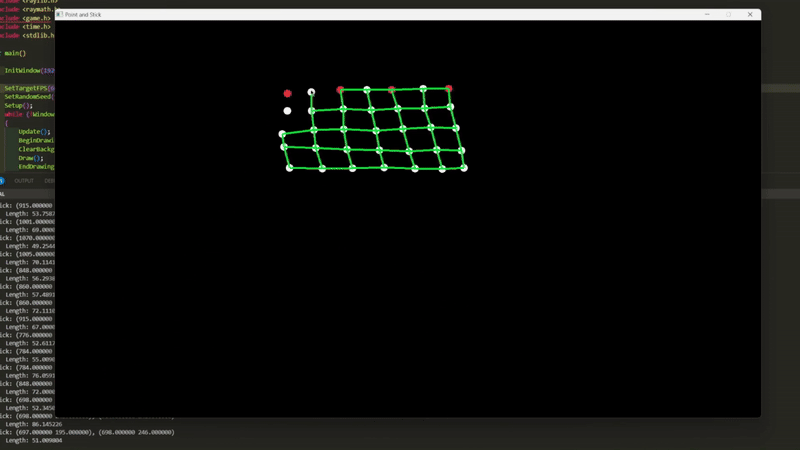

# Point und Stick

Simple 2D rope/cloth simulation with C++ and Raylib. Implements verlet's integration to simulate physics on 2D nodes bounded by edges within each other.

  

## Build and Run

### Windows:
`make`

## Controls

- Click the left mouse button on screen to put a node.
- Connect nodes by clicking and dragging between nodes.
- Cycle between static immovable red nodes and movable white nodes with `A`.
- Press `SPACE` to play/pause the simulation.
- Drag mouse right click accross edges to 'cut' the edges.

## Showcase

### Editing to setup nodes
  

### Running simulation with cut edges
  

## To-Do
- Implement memory safety with smart pointers.
- Implement more efficient data structure to add/delete edges.

## Warning

This project has memory safety issues, deleted edges and unrendered nodes are not cleared from memory (long live C++).